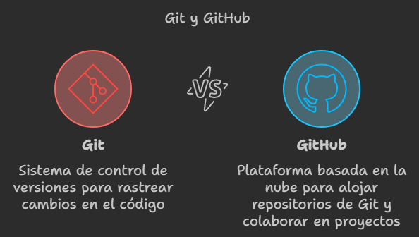
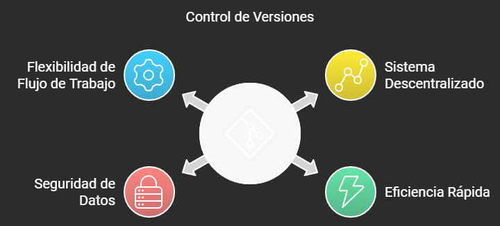

# Manual de Git y Github. Comandos básicos

- [Manual de Git y Github. Comandos básicos](#manual-de-git-y-github-comandos-básicos)
- [Un poco de Historia](#un-poco-de-historia)
- [Instalación de Git 🪛](#instalación-de-git-)
  - [En Linux](#en-linux)
  - [En macOS](#en-macos)
  - [En Windows](#en-windows)
- [Configuración inicial](#configuración-inicial)
  - [Opciones de configuración de Git](#opciones-de-configuración-de-git)
- [Inicializar un repositorio](#inicializar-un-repositorio)
- [Áreas que utiliza Git](#áreas-que-utiliza-git)
  - [Área de Trabajo (Working Directory)](#área-de-trabajo-working-directory)
  - [Área de Preparación (Staging Area)](#área-de-preparación-staging-area)
    - [Algunos comandos para trabajar con el área de preparación son](#algunos-comandos-para-trabajar-con-el-área-de-preparación-son)
  - [Repositorio Local (Local Repository)](#repositorio-local-local-repository)
    - [Algunos comandos para este área](#algunos-comandos-para-este-área)
  - [Repositorio Remoto (Remote Repository)](#repositorio-remoto-remote-repository)
    - [Algunos comandos para este área remota](#algunos-comandos-para-este-área-remota)
- [Clonar un repositorio](#clonar-un-repositorio)
- [Agregar elementos al staging area](#agregar-elementos-al-staging-area)
  - [git add](#git-add)
    - [Opciones](#opciones)
- [Crear un commit con los cambios del repositorio](#crear-un-commit-con-los-cambios-del-repositorio)
  - [git commit](#git-commit)
    - [Opciones](#opciones-1)
  - [Nota 🗒](#nota-)

---

En la era digital actual, la gestión eficiente del código fuente y la colaboración en proyectos de desarrollo son fundamentales para el éxito de las empresas. `Git y GitHub` se han convertido en herramientas esenciales para los desarrolladores y equipos de trabajo, facilitando el control de versiones y la colaboración en tiempo real.

<div style="text-align: center;">
  
</div>

<div style="page-break-after: always;"></div>

# Un poco de Historia

La creciente complejidad del kernel de Linux exigía una solución más eficiente para gestionar sus múltiples versiones. Ante esta necesidad, Linus Torvalds desarrolló Git en 2005. Esta herramienta, diseñada específicamente para proyectos a gran escala, se convirtió rápidamente en el estándar de la industria.

Sus características más importantes serían:

- **Descentralizado**: A diferencia de otros sistemas de control de versiones centralizados, Git permite que cada desarrollador tenga una copia completa del repositorio en su equipo. Esto facilita la colaboración y la creación de ramas.
- **Rápido y eficiente**: Git está optimizado para realizar operaciones comunes como crear ramas, fusionar cambios y ver el historial de versiones de forma muy rápida.
- **Seguro**: Git utiliza un sistema de hash para garantizar la integridad de los datos y evitar la pérdida de información.
- **Flexible**: Git se adapta a una gran variedad de flujos de trabajo y proyectos, desde pequeños proyectos individuales hasta grandes desarrollos colaborativos.

<div style="text-align: center;">
  
</div>

# Instalación de Git 🪛

## En Linux

```bash
sudo apt update
sudo apt install git
```

## En macOS

```bash
brew install git
```

## En Windows

Puedes descargar Git desde [Git for Windows](https://gitforwindows.org/).

Para verificar la instalación:

```bash
git --version
```

# Configuración inicial

Antes de comenzar a utilizar Git, es importante configurar tu nombre de usuario y dirección de correo electrónico. Puedes hacerlo utilizando los siguientes comandos:

```bash
git config --global user.name "isaias"
git config --global user.email "tu@email.com"
```

## Opciones de configuración de Git

Git ofrece una amplia gama de opciones de configuración que te permiten personalizar tu entorno de trabajo. Algunas de las opciones más comunes de `git config` son:

- `--global`: Esta opción permite establecer la configuración de forma global para todos los repositorios en tu sistema. Por ejemplo:

  ```bash
  git config --global user.name "isaias"
  git config --global user.email "tu@email.com"
  ```

- `--local`: Esta opción establece la configuración específica para el repositorio actual. Por ejemplo:

  ```bash
  git config --local core.autocrlf true

  #🌟 Los Finales de línea:  Son caracteres especiales que indican el final de una línea de texto en un archivo.
  # Diferentes sistemas operativos utilizan diferentes convenciones para representar los finales de línea:
  # --> Windows: Utiliza una combinación de dos caracteres (Carriage Return y Line Feed), comúnmente abreviados como CRLF.
  # --> Linux/macOS: Utiliza un solo carácter (Line Feed), abreviado como LF.

  # Si trabajas principalmente en Windows: Esta configuración es una buena opción para simplificar
  # la gestión de los finales de línea.
  # Si colaboras con personas que usan diferentes sistemas operativos: Ayuda a mantener una consistencia
  # en el repositorio y evita conflictos.
  ```

- `--system`: Esta opción establece la configuración a nivel de sistema para todos los usuarios en la máquina. Requiere privilegios de administrador. Por ejemplo:

  ```bash
  git config --system core.editor "vim"

  ```

- `--unset`: Esta opción permite eliminar una opción de configuración existente. Por ejemplo:

  ```bash
  git config --unset user.name
  ```

- Configurar nombre de la Rama de inicio por defecto

  ```bash
  git config --global init.defaultBranch main
  ```

- Configurar editor por defecto

  ```bash
  git config --global core.editor "code --wait"

  # --wait: Esta opción le indica a Visual Studio Code que espere hasta que cierres el archivo editado
  # antes de continuar con el siguiente comando de Git. Esto es útil para evitar que Git intente realizar
  # otras acciones mientras estás editando el mensaje de commit.

  git config --system --get core.editor

  # Esto debería mostrar la ruta completa a tu instalación de editor por defecto en la configuración System.
  ```

# Inicializar un repositorio

Para iniciar un nuevo repositorio Git en un directorio existente, puedes utilizar el comando `git init`. Por ejemplo:

```bash
git init
git init nombre_de_la_carpeta
```

# Áreas que utiliza Git

Git gestiona los cambios en el código a través de diferentes áreas. En concreto hay 3 áreas principales si sólo trabajamos en local o 4 si trabajamos en remoto.

<div style="text-align: center;">
  
</div>

## Área de Trabajo (Working Directory)

Es la carpeta donde tienes tu proyecto. En esta área es donde haces todos los cambios, como editar, crear o eliminar archivos.

- **Modificar Archivos**: Aquí es donde trabajas activamente en tu código.
- **Reflejar el Estado Actual**: La área de trabajo muestra la versión actual de los archivos en tu proyecto.

## Área de Preparación (Staging Area)

También conocida como "index", el área de preparación es un espacio intermedio donde puedes seleccionar y revisar los cambios que deseas incluir en el siguiente commit.

- **Seleccionar Cambios**: Te permite elegir qué cambios específicos se incluirán en el próximo commit, sin necesidad de comprometer todos los cambios realizados en el área de trabajo.
- **Revisar Cambios**: Puedes revisar y organizar qué archivos o partes de archivos deseas agregar al commit.

### Algunos comandos para trabajar con el área de preparación son

- `git add <archivo>`: Agrega cambios al área de preparación.
- `git reset <archivo>`: Quita cambios del área de preparación.

## Repositorio Local (Local Repository)

Es donde Git almacena la historia de cambios de tu proyecto. Se encuentra dentro de la carpeta de tu proyecto y contiene todos los commits realizados. Este área es donde se almacenan los cambios que has preparado para el siguiente commit.

- **Historial de Cambios**: Guarda todos los commits que has realizado, permitiéndote volver a versiones anteriores.
- **Ramas y Etiquetas**: Permite crear ramas para trabajar en diferentes características o correcciones sin afectar la rama principal.

### Algunos comandos para este área

- `git commit`: Guarda los cambios del área de preparación en el repositorio local.
- `git log`: Muestra el historial de commits.

## Repositorio Remoto (Remote Repository)

Es una versión del repositorio que se encuentra en un servidor remoto, como GitHub, GitLab o Bitbucket. Es donde se comparte el código con otros colaboradores. Lo más importante de este area es:

- **Colaboración**: Permite a múltiples usuarios trabajar en el mismo proyecto, compartiendo y sincronizando cambios.
- **Respaldo**: Proporciona un lugar seguro para almacenar el código y el historial de cambios.

### Algunos comandos para este área remota

- `git push`: Envía tus commits del repositorio local al remoto.
- `git pull`: Trae cambios del repositorio remoto al local.

# Clonar un repositorio

Si deseas obtener una copia de un repositorio existente, puedes utilizar el comando `git clone`. Por ejemplo, para clonar un repositorio remoto:

```bash
git clone https://github.com/usuario/repositorio.git
```

# Agregar elementos al staging area

## git add

El comando `git add` se usa para indicar a Git qué cambios deben ser incluidos en el siguiente commit.

```bash
git add <archivo>
```

### Opciones

- `.`: Agrega todos los cambios en el directorio actual y subdirectorios.

  ```bash
  git add .
  ```

- `-A` o `--all`: Agrega todos los cambios, incluyendo archivos eliminados.

  ```bash
  git add -A
  ```

- `-p` o `--patch`: Permite agregar cambios de manera interactiva, eligiendo qué partes de un archivo agregar.

  ```bash
  git add -p
  ```

- `-n` o `--dry-run`: Muestra qué archivos se agregarían sin realmente agregarlos.

  ```bash
  git add -n .
  ```

  Para eliminar elementos del área de preparación, puedes usar el comando `git reset`. Este comando te permite quitar cambios que hayas agregado previamente. Aquí tienes un ejemplo:

  ```bash
  git reset <archivo>  # Quita un archivo específico del área de preparación
  ```

  Recuerda que quitar un archivo del área de preparación no descarta los cambios que hayas hecho en el archivo, simplemente los mueve de vuelta al directorio de trabajo. Si quieres descartar los cambios por completo, puedes usar el comando `git checkout` que veremos más adelante

# Crear un commit con los cambios del repositorio

## git commit

El comando `git commit` se utiliza para guardar los cambios que has añadido al área de preparación.

```bash
git commit -m "Mensaje del commit"
```

### Opciones

- `-m`: Permite especificar un mensaje de commit en línea.

  ```bash
  git commit -m "Mensaje del commit"
  ```

- `-a` o `--all`: Agrega automáticamente todos los archivos modificados y eliminados al commit, omitiendo la necesidad de usar `git add` previamente.

  ```bash
  git commit -a -m "Commit automático de archivos modificados"
  ```

- `--amend`: Modifica el último commit en lugar de crear uno nuevo.

  ```bash
  git commit --amend -m "Mensaje actualizado"
  ```

- `--no-edit`: Utilizado con `--amend` para conservar el mensaje de commit anterior sin cambiarlo.

  ```bash
  git commit --amend --no-edit
  ```

## Nota 🗒

En Git, los -- se utilizan como un delimitador para indicar que lo que sigue es un nombre de archivo o ruta, no opciones o flags para el comando. Esto es especialmente útil cuando hay ambigüedad en la interpretación de argumentos.

---

```text

# Manual en construcción 🚧

Este manual está en proceso de desarrollo y actualización constante.
Aunque contiene información útil sobre Git y GitHub, es importante tener en cuenta que aún no está completo y puede haber secciones que requieran más detalles o ejemplos.
Si tienes alguna sugerencia o comentario sobre cómo puedo mejorar este manual, no dudes en realizar un Pull Request.
Tu retroalimentación es muy valiosa para mi.


    🦖 Isaías FL
    📧 ifernandez@ieshlanz.es
```

---
