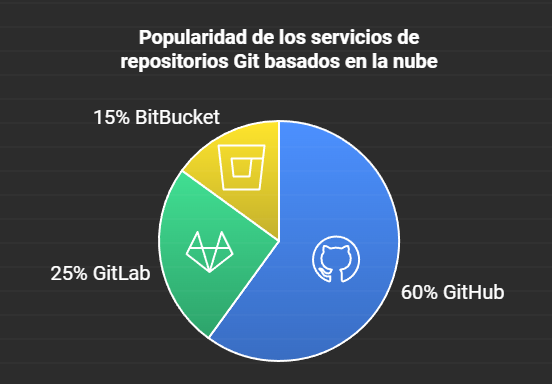

# Manual detallado de Git

## 1. Qué es el control de versiones

Un sistema de control de versiones es una herramienta que registra todos los cambios realizados en el código fuente de un proyecto, para que puedas mantener un historial detallado de los cambios realizados por quién y cuándo. Aunque parece un sistema de respaldo, va un paso más allá y facilita la gestión de actualizaciones y la colaboración entre varias personas que trabajan en el mismo proyecto. En lugar de pensar en el control de versiones como una simple línea de tiempo, es más útil pensar en él como un sistema de ramas y bifurcaciones.

Por ejemplo, en Git, la rama maestra (llamada master o main) actúa como el tronco de un árbol, mientras que la rama de desarrollo (branches) es una bifurcación que se puede fusionar nuevamente con la rama maestra si es necesario. El valor real de un sistema de control de versiones como Git no está solo en crear copias de seguridad, sino también en facilitar la colaboración para que varias personas puedan trabajar en un proyecto al mismo tiempo. Además, proporciona herramientas para verificar y sincronizar cambios, mejorar la calidad del código y el flujo de trabajo del equipo.

## 2. Historia de Git

Git es un sistema de control de versiones descentralizado gratuito y de código abierto con licencia GPLv2.
Fue desarrollado originalmente por Linus Torvalds, el creador de Linux.
Al ser un control de versiones como he dicho, podríamos comenzar a trabajar fácilmente en un proyecto de forma local. También, podríamos crear nuestro propio servidor de forma que cualquier persona pudiera desarrollar de forma remota. Sin embargo, el mantenimiento que un servidor de este tipo suele ser muy costoso. Ahí es donde entra GitHub. Github es un servicio de alojamiento en la nube de código fuente basado en el sistema de control de versiones que Git ofrece para manejar repositorios. Añade además otras funcionalidades muy útiles para el desarrollo, como una UI muy amigable, GitHub Actions, etc.

Git y GitHub están relacionados pero son dos cosas diferentes. Hay que tener en cuenta que GitHub no es el único servicio de este estilo. Existen otras alternativas como GitLab o BitBucket que permiten también hospedar códigos fuentes en la nube versionados con Git

<div style="text-align: center;">
  
</div>

## 3. Instalación de Git

### En Linux:

```bash
sudo apt update
sudo apt install git
```

### En macOS:

```bash
brew install git
```

### En Windows:

Puedes descargar Git desde [Git for Windows](https://gitforwindows.org/).

Para verificar la instalación:

```bash
git --version
```

## 4. Comandos básicos de la terminal

- `pwd`: Muestra el directorio actual.
- `ls`: Lista los archivos del directorio.
- `cd [directorio]`: Cambia de directorio.
- `mkdir [nombre]`: Crea un nuevo directorio.
- `rm [archivo]`: Elimina un archivo.

## 5. Configuración de Git

Antes de comenzar a trabajar con Git, es necesario configurarlo con tu información personal:

```bash
git config --global user.name "Tu Nombre"
git config --global user.email "tuemail@ejemplo.com"
```

Puedes verificar la configuración usando:

```bash
git config --list
```

## 6. `git init`

El comando `git init` se usa para inicializar un nuevo repositorio de Git en un directorio existente.

```bash
git init
```

Este comando crea un directorio `.git`, donde se almacenan todos los archivos y metadatos necesarios para el control de versiones.

## 7. Ramas en Git

Una rama en Git representa una línea de desarrollo independiente. Git facilita la creación y fusión de ramas para mantener diferentes versiones del proyecto. La rama principal generalmente se llama `main` o `master`.

Crear una nueva rama:

```bash
git branch [nombre-de-la-rama]
```

## 8. `git add` y `git commit`

- `git add`: Agrega cambios al área de preparación (staging).

```bash
git add [archivo]
```

- `git commit`: Guarda los cambios del área de preparación al historial de versiones.

```bash
git commit -m "Mensaje descriptivo del cambio"
```

## 9. `git log` y `git status`

- `git log`: Muestra el historial de commits.

```bash
git log
```

- `git status`: Muestra el estado actual del repositorio, indicando qué archivos han sido modificados, agregados o eliminados.

```bash
git status
```

## 10. `git checkout` y `git reset`

- `git checkout`: Cambia de rama o restaura archivos.

```bash
git checkout [rama]
```

- `git reset`: Deshace cambios en el historial.

```bash
git reset [commit]
```

## 11. `git alias`

Puedes crear alias para comandos frecuentes:

```bash
git config --global alias.co checkout
git config --global alias.br branch
```

Esto permite usar `git co` en lugar de `git checkout`.

## 12. Fichero `.gitignore`

El archivo `.gitignore` indica a Git qué archivos o directorios deben ser ignorados (no versionados). Un ejemplo común es ignorar archivos de configuración o de compilación.

```bash
*.log
node_modules/
.env
```

## 13. `git diff`

Muestra las diferencias entre versiones de archivos o entre el estado actual y el último commit.

```bash
git diff
```

## 14. Desplazamiento en una rama

Para moverse dentro de una rama, puedes usar el comando `git checkout` para cambiar a un commit específico.

```bash
git checkout [commit]
```

## 15. `git reset --hard` y `git reflog`

- `git reset --hard`: Restablece el árbol de trabajo al estado de un commit específico, descartando todos los cambios.

```bash
git reset --hard [commit]
```

- `git reflog`: Muestra un historial de todos los cambios en los encabezados de las ramas, incluso aquellos que se han "perdido".

```bash
git reflog
```

## 16. `git tag`

Crea etiquetas para marcar versiones específicas del proyecto.

```bash
git tag [nombre-etiqueta]
```

## 17. `git branch` y `git switch`

- `git branch`: Lista o gestiona las ramas del proyecto.

```bash
git branch
```

- `git switch`: Cambia de una rama a otra.

```bash
git switch [rama]
```

## 18. `git merge`

Fusiona el contenido de una rama en la rama actual.

```bash
git merge [rama]
```

## 19. Resolución de conflictos en Git

Cuando Git no puede fusionar cambios automáticamente, se genera un conflicto. Git marcará el archivo en conflicto, y tendrás que editarlo manualmente para resolver el problema. Una vez resuelto:

```bash
git add [archivo-resuelto]
git commit -m "Resuelto el conflicto"
```

## 20. `git stash`

Guarda temporalmente los cambios no confirmados en el repositorio sin tener que hacer un commit.

```bash
git stash
```

Para aplicar los cambios guardados:

```bash
git stash pop
```
