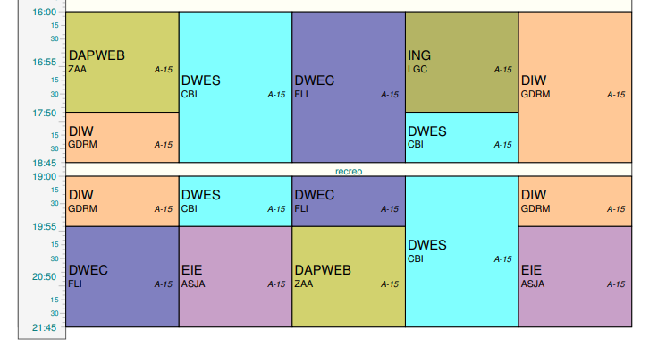
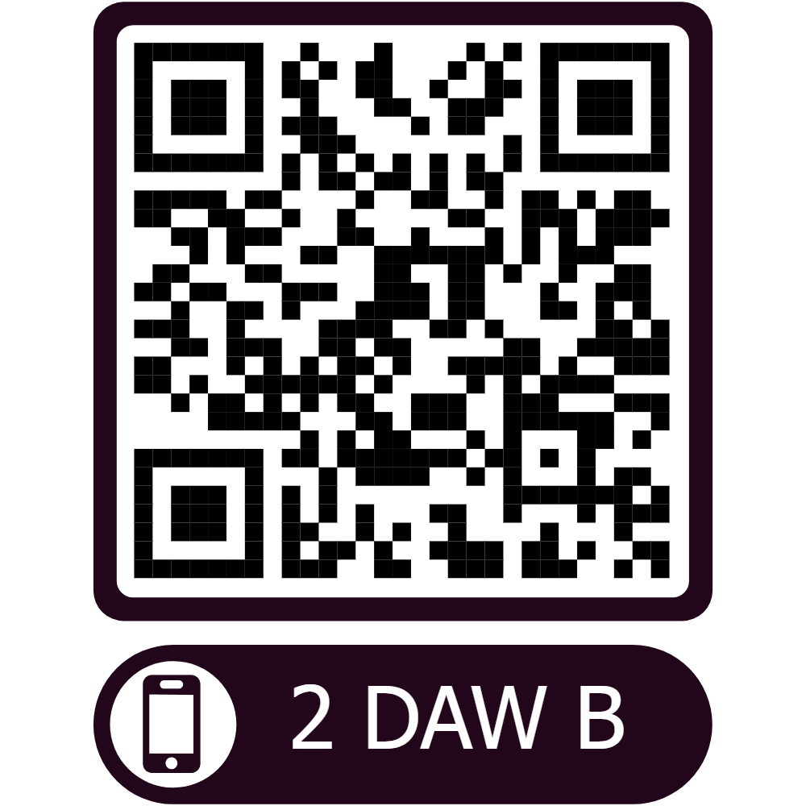

# Título: **Técnico Superior en Desarrollo de Aplicaciones Web**

## 1. Horario 2º DAW Bilingüe

  

## 2. Profesorado y módulos que se imparten

| Siglas     | Nombre del Módulo                          | Profesor/a               | Horas     |
| ---------- | ------------------------------------------ | ------------------------ | --------- |
| **DAPWEB** | Despliegue de Aplicaciones Web             | Alberto Zagalaz Anula    | 4 h/s     |
| **DIW**    | Diseño de Interfaces Web                   | Rosa María García Díaz   | 6 h/s     |
| **DWEC**   | Desarrollo Web Entorno Cliente             | Isaías Fernández Lozano  | 6 h/s     |
| **DWES**   | Desarrollo Web Entorno Servidor            | Ignacio Cabrero Barragán | 8 h/s     |
| **EIE**    | Empresa e Iniciativa Emprendedora          | Jose Antonio Asensio     | 4 h/s     |
| **ING**    | Inglés                                     | Concepción Leyva         | 2 h/s     |
|            |                                            |                          |           |
|            | _Otros Módulos_                            |                          |           |
| **FCT**    | Formación en Centros de Trabajo            |                          | 370 horas |
| **PI**     | Proyecto de Desarrollo de Aplicaciones Web |                          | 40 horas  |

## 3. Tutor

- Nombre: _**Isaías Fernández Lozano**_
- Email: ifernandez@ieshlanz.es
- Github: https://github.com/isaiasfl

## 4. Enlace QR

  

